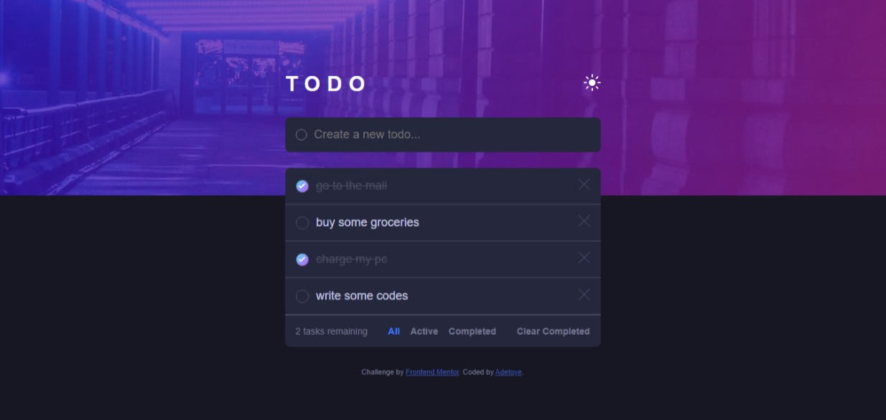

# Frontend Mentor - Todo app solution

This is a solution to the [Todo app challenge on Frontend Mentor](https://www.frontendmentor.io/challenges/todo-app-Su1_KokOW). Frontend Mentor challenges help you improve your coding skills by building realistic projects. 

## Table of contents

- [Overview](#overview)
  - [The challenge](#the-challenge)
  - [Screenshot](#screenshot)
  - [Links](#links)
- [My process](#my-process)
  - [Built with](#built-with)
  - [What I learned](#what-i-learned)
  - [Continued development](#continued-development)
- [Author](#author)


## Overview

### The challenge

Users should be able to:

- View the optimal layout for the app depending on their device's screen size
- See hover states for all interactive elements on the page
- Add new todos to the list
- Mark todos as complete
- Delete todos from the list
- Filter by all/active/complete todos
- Clear all completed todos
- Toggle light and dark mode
- **Bonus**: Drag and drop to reorder items on the list

### Screenshot




### Links

- Solution URL: [View Solution](https://www.frontendmentor.io/solutions/html5-css3-flexbox-mobilefirst-workflow-vanilla-js-QT68ja8vUZ)
- Live Site URL: [View Live Demo](https://todo-app-drab-zeta-54.vercel.app)

## My process

A large part of this project was made with functional programming and DOM manipulations, I also implemented a little bit of OOP in creating the task lists, and this was so that i could easily track the number of active tasks by storing them in an array. And also so that I could easily give each task {object} it's own unique properties and identity.

### Built with

- Semantic HTML5 markup
- CSS custom properties
- Flexbox
- Mobile-first workflow
- Vanilla Js


### What I learned

I had quite a lot of challenge trying to get the input values saved after the page is refreshed, so in the process of finding a solution, I actually got to learn about LOCAL_STORAGE, SESSIONS, AND COOKIES, which was to lot of fun to learn by the way :). I also learnt about the html <template> tag in the process and being able to import it in Js using importNode.

See code snippets below:

```html
  <template id="task-template">
    <li class="list-item">
      <input type="checkbox" name="radio" class="check-complete-btn">
      <label class="input-label">
        
      </label>
      <span class="task-name"></span>
      <span class="delete-task-btn">
        
      </span>
    </li>
  </template>
```
```js
  const LOCAL_STORAGE_LIST_KEY = 'todo.lists';
  const LOCAL_STORAGE_LIST_ID_KEY = 'todo.listsId';
  let listItems = JSON.parse(localStorage.getItem(LOCAL_STORAGE_LIST_KEY)) || [];
  let listItemId = localStorage.getItem(LOCAL_STORAGE_LIST_ID_KEY);
```


### Continued development

I intend to continue with the project sometimes soon by including a drag and drop feature to re-arrange tasks.


## Author

- Website - [Adetoye](https://adetoye.vercel.app)
- Frontend Mentor - [@adetoye-dev](https://www.frontendmentor.io/profile/adetoye-dev)
- Twitter - [@adetoye_dev](https://www.twitter.com/adetoye_dev)

